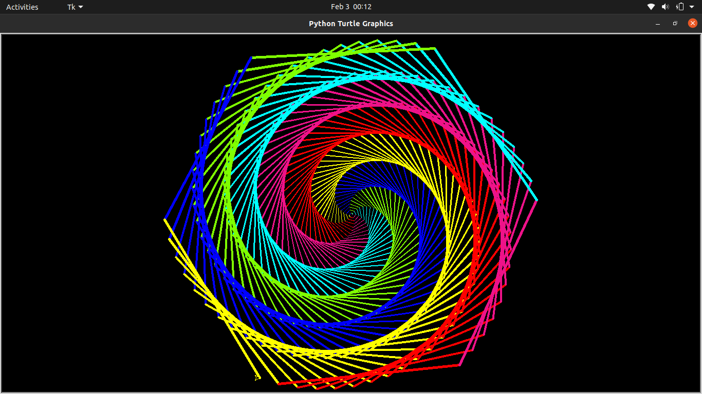

# Python_Colorful_Pattern
This is a Python Program that gives out a Colorful and Mesmerizing Pattern. It uses a built-in Module named turtle. Below is my the Screenshot of my Program:

Also Below is the image of what final Pattern would look alike:

And here you can see the final pattern output as the GIF Below:

Hope that you liked it.
